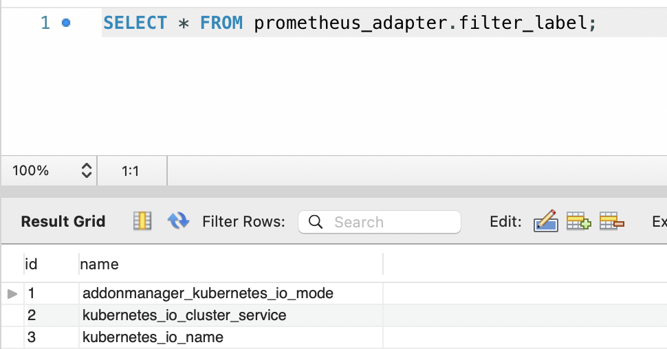

# adapter


- 设计理念

1)读取数据库配置，获取指标信息，去节点上拉取指标，写入到目的prometheus


```
cap_name:  新的指标名称
cap_sql:   抓取的语句
status:    1 表示启用、0 表示禁用
instance:  抓取的实例地址
```
2)标签删除


label中的key在该表记录中，会直接删除该标签

- 缺陷

源需要和adapter.yaml里面一一对应，后面需要优化一下，可以实现自动发现实例，自动扩容